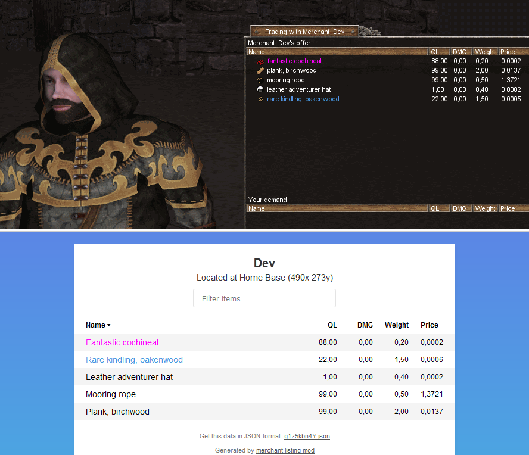

# Merchant Listing
Stay up to date with your favourite Wurm merchants. Currently in beta.

## How it works
- Right-click a merchant in Wurm Unlimited and choose "get listing"
- Open the URL in your webbrowser to view an up-to-date list of the
  merchant's inventory at any time, even when you're not ingame.

## Setup
This is a WU server mod, and uses Ago's modlauncher.

- Download the latest release
- Copy the files into the mods folder of your server
- Edit the settings in the properties file
- Open the chosen port on your server if necessary
- Start the game and visit one of your merchants to check that it works

## Bugs
If you find a bug, please create an issue or report it in the mod thread
on the Wurm forums.
